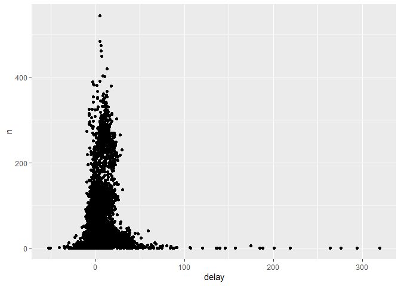

Stat 433 Wk2 Hw
================
Nick Bowe
9/28/2021

\#1. How many flights have a missing dep\_time? What other variables are
missing? What might these rows represent?

``` r
library(nycflights13)
library(dplyr)
```

    ## 
    ## Attaching package: 'dplyr'

    ## The following objects are masked from 'package:stats':
    ## 
    ##     filter, lag

    ## The following objects are masked from 'package:base':
    ## 
    ##     intersect, setdiff, setequal, union

``` r
library(ggplot2)

filter(flights, is.na(dep_time)) %>% View
#There are 8,255 entries, therefore there are 8,255 flights without departure times.

#Other rows that are missing variables include, arr_time, air_time, and various variables that rely on those two having values. This could be due to the fact that a flight was either cancelled before it had the opportunity to take off, or perhaps was rerouted while in the air meaning the flight was not recorded.
```

\#2 Currently dep\_time and sched\_dep\_time are convenient to look at,
but hard to compute with because they’re not really continuous numbers.
Convert them to a more convenient representation of number of minutes
since midnight.

``` r
flightb = flights %>% 
  mutate(dep_time = 2400 - dep_time) %>% 
  mutate(sched_dep_time = 2400 - sched_dep_time)

head(flightb %>% select(dep_time, sched_dep_time))
```

    ## # A tibble: 6 x 2
    ##   dep_time sched_dep_time
    ##      <dbl>          <dbl>
    ## 1     1883           1885
    ## 2     1867           1871
    ## 3     1858           1860
    ## 4     1856           1855
    ## 5     1846           1800
    ## 6     1846           1842

\#3 Look at the number of canceled flights per day. Is there a pattern?
Is the proportion of canceled flights related to the average delay? Use
multiple dyplr operations, all on one line, concluding with
ggplot(aes(x= ,y=)) + geom\_point()

``` r
not_cancelled = flights %>%
  filter(!is.na(dep_delay), !is.na(arr_delay))

not_cancelled %>% 
  group_by(tailnum) %>% 
  summarise(
    delay = mean(arr_delay, na.rm = TRUE),
    n = n()
  ) %>% 
  ggplot(mapping = aes(y = n, x = delay)) + 
  geom_point()
```

<!-- -->

``` r
# Unsure how to really flesh out this thought???
```
